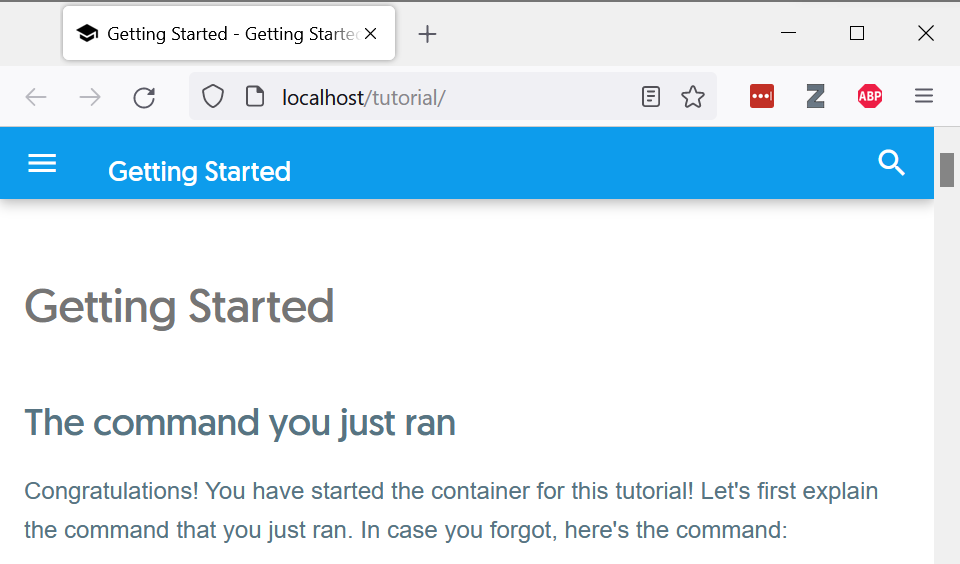

# Docker

Steps for using docker containers as a dev environment in WSL.

1. Install Docker Desktop for Windows (it will install what you need in WSL and gives a clean GUI on the Windows side): https://docs.docker.com/docker-for-windows/wsl/#download
    - If you'd like to isolate on WSL, check out these installation/configuration instructions: https://dev.to/felipecrs/simply-run-docker-on-wsl2-3o8

2. Run the standard hello-world container (it will download from dockerhub)
    ```
    $ docker run hello-world

    Hello from Docker!
    This message shows that your installation appears to be working correctly.

    To generate this message, Docker took the following steps...
    ```

3. Run an Ubuntu container:
    ```
    $ docker run -it ubuntu
    root@9b8e3b3dd941:/# ls
    bin  boot  dev  etc  home  lib  lib32  lib64  libx32  media  mnt  opt  proc  root  run  sbin  srv  sys  tmp  usr  var
    root@9b8e3b3dd941:/# exit
    exit

    ~/code/hello-world
    $
    ```
    Note: -it is for "interactive" and "tty". Try running without either and see what happens.

4. Try running these commands a few more times. Easy - `docker run hello-world` prints something, `docker run -it ubuntu` opens a bash session, right? Yes, but it's best to think of docker containers as VMs. So the `hello-world` VM just exists to print a message and then stop, but every time your run it you get an additional VM hanging around. Run the following and see what containers are hanging around:
    ```
    $ docker ps --all
    CONTAINER ID   IMAGE         COMMAND    CREATED          STATUS                      PORTS     NAMES
    27640900999e   hello-world   "/hello"   4 seconds ago    Exited (0) 3 seconds ago              zen_moser
    e2774706fe46   ubuntu        "bash"     9 seconds ago    Exited (0) 5 seconds ago              infallible_hellman
    4bcd0a75636b   ubuntu        "bash"     16 seconds ago   Exited (0) 10 seconds ago             compassionate_ritchie
    c7276baf810b   hello-world   "/hello"   19 seconds ago   Exited (0) 17 seconds ago             recursing_tesla
    04e8bb5c5292   hello-world   "/hello"   21 seconds ago   Exited (0) 20 seconds ago             sweet_stonebraker
    9b8e3b3dd941   ubuntu        "bash"     6 minutes ago    Exited (0) 6 minutes ago              unruffled_sammet
    ```

5. Since these are just "turned off VMs", you can just start one back up again instead of creating a new one:
    ```
    $ docker start 9b8e3b3dd941
    9b8e3b3dd941

    ~/code/hello-world
    $ docker ps --all
    CONTAINER ID   IMAGE         COMMAND    CREATED         STATUS                     PORTS     NAMES
    27640900999e   hello-world   "/hello"   2 minutes ago   Exited (0) 2 minutes ago             zen_moser
    e2774706fe46   ubuntu        "bash"     2 minutes ago   Exited (0) 2 minutes ago             infallible_hellman
    4bcd0a75636b   ubuntu        "bash"     2 minutes ago   Exited (0) 2 minutes ago             compassionate_ritchie
    c7276baf810b   hello-world   "/hello"   3 minutes ago   Exited (0) 2 minutes ago             recursing_tesla
    04e8bb5c5292   hello-world   "/hello"   3 minutes ago   Exited (0) 3 minutes ago             sweet_stonebraker
    9b8e3b3dd941   ubuntu        "bash"     9 minutes ago   Up 20 seconds                        unruffled_sammet

    ~/code/hello-world
    $ docker attach 9b8e3b3dd941
    root@9b8e3b3dd941:/#
    ```
    Note: You can also do `docker start` with one of the hello-world containers, but it won't look like anything happened. In reality it starts, prints it's message into thin air, and exits. To get it to print its message to the terminal, run `docker start -i`.

6. These VMs hanging around aren't actually a problem because they take up very little space, but deleting them is easy enough:
    ```
    $ docker container prune
    WARNING! This will remove all stopped containers.
    Are you sure you want to continue? [y/N] y
    Deleted Containers:
    27640900999e46d9b211ccf68f53957bd9e83b9971548b57e47bb3b9da764d6a
    e2774706fe46eb75a80a1ba12e036bb98ecda114cfd777f56a0e75527d72fa62
    4bcd0a75636b3b15149ba9534533a9b24b9d247ef9b2391d9ad1bbb7007935a1
    c7276baf810bf2b1541d530b5e06abbe3648d771fb54578f51d7749122ac540f
    04e8bb5c5292526df30075bc223439a0c91daad27088d3ed04dee6a9f25a2197
    9b8e3b3dd941a54fa891224911c08fc81c20ca2202d202b331efc4653727f737

    Total reclaimed space: 62B

    :~/code/hello-world
    $ docker ps --all
    CONTAINER ID   IMAGE     COMMAND   CREATED   STATUS    PORTS     NAMES
    ```

7. Since `docker container prune` only removes stopped containers, here is how to stop all running containers:
    ```
    $ docker stop $(docker ps -aq)
    ```
    Or to remove all whether stopped or not:
    ```
    $ docker rm -f $(docker ps -aq)
    ```

8. Run a container that exposes a web service on port 80 and connect our host port 80 to that port (host_port:container_port):
    ```bash
    $ docker run -d -p 80:80 docker/getting-started
    2062d80209758816af71975f4e766ab203d115e510c1a303e13eaf09b93abf69
    ```

9. Go to http://localhost:80:

    

10. For how to create a docker image, see [hello-dockerfile](hello-dockerfile/README.md).

### Next steps:
1. [hello-dockerfile](hello-docker/hello-dockerfile/README.md)  
2. [hello-docker-volumes](hello-docker/hello-docker-volumes/README.md)  
3. [hello-docker-dev](hello-docker/hello-docker-dev/README.md)  
4. [hello-docker-gpu](hello-docker/hello-docker-gpu/README.md)  
5. [hello-docker-gui](hello-docker/hello-docker-gui/README.md) 