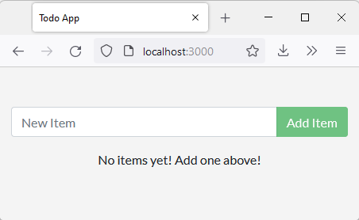
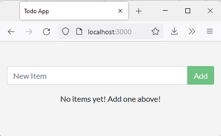

# Docker Volumes

## Named Volumes

Based on the tutorial from https://docs.docker.com/get-started/02_our_app/. Using a simple Node.js app for creating a to-do list, this goes through the steps of creating a space on your hard drive where the sqlite database can get stored and reused by future container instances.

1. Cd into the app folder and notice the source files, the `package.json` dependencies list, the `yarn.lock`, and the `Dockerfile` that together make a working Node.js app.
    ```
    $ cd app/
    ~/code/hello-world/hello-docker/hello-docker-volumes/app
    $ ls
    Dockerfile  package.json  spec  src  yarn.lock
    ```

2. Build a docker image for this app:
    ```
    $ docker build -t todo-app .
    [+] Building 17.7s (11/11) FINISHED                                                                                                                                                                                              
    => [internal] load build definition from Dockerfile         0.0s
    ...                                                                                                                            
    ~/code/hello-world/hello-docker/hello-docker-volumes/app
    $ docker image ls
    REPOSITORY                     TAG                                        IMAGE ID       CREATED          SIZE
    todo-app                       latest                                     45489d9de354   20 seconds ago   404MB
    ```
    Note: You can run the app with `docker run -dp 3000:3000 todo-app`, add a todo list item, delete the container and start it again to see that items are not persisted after a container.

3. Create a "volume", or the space on the local hard drive where data will be stored:
    ```
    $ docker volume create todo-db
    todo-db
    ~/code/hello-world
    $ docker volume ls
    DRIVER    VOLUME NAME
    local     todo-db
    ```

4. Now run the app and have the volume from our local hard drive mounted in the container filesystem at the location where it stores the sqlite database. Thus any changes to the database when running the app are actually written to the local hard drive instead of the container filesystem which gets thrown away. If you look at `app/src/persistence/persistence/sqlite.js` line 3 you'll see that the database is stored at `/etc/todos/todo.db`. So we want to link our volume to `/etc/todos`. Run a new instance of the app with this volume linked:
    ```
    $ docker run -dp 3000:3000 -v todo-db:/etc/todos todo-app
    9e4fd4fc76ef9cf3e1989c2a9b34c06d973edfd17b3ba1ef7f2353254f35fd33
    ```

## Bind Mounts

This is the textbook production setup: a containerized app with persistent storage. So far we have been using our local machine as a dev environment, but our local machine is running WSL Ubuntu and the app uses Alpine and our dependencies aren't 100% isolated. So it might be nice to use a docker container to run Alpine and develop inside the container. To set that up, we want to use our volume to contain our src code so our code changes live locally. We could used a volume like above (technically a "named volume") and know that our code is living in the local docker app's storage space (in `/var/lib/docker/volumes`, which is actually in a VM when running Windows Docker Desktop). However, it would be nicer to to be able to keep local dev environment organized as normal and simply tell the Alpine container where to link to our local code. To do this, we replace the "named volume" with a "bind mount".

1. Run `node:12-alpine`, create a working directory in the container called app (`-w /app`) and create a bind mount from app on your local machine to this working directory (with `-v`). We also have to give the Alpine a command to run so it doesn't exit immediately, so we have it do `yarn run dev` which starts the node server listening on port 3000.
    ```
    $ docker run -dp 3000:3000 \
    >     -w /app -v "$(pwd):/app" \
    >     node:12-alpine \
    >     sh -c "yarn install && yarn run dev"
    f557b76ed5005d1d548990c45c01ceebf737f11a7736b3bb58f1dbd17552692a
    ```

2. So now we have a container with our codebase, running the app from our code. Since the code in the container is linked to our code locally, we can make a change locally and see the change take affect in the container (by watching the app running on port 3000). Change line 109 in `src/static/js/app.js`:
    ```diff
    -                         {submitting ? 'Adding...' : 'Add Item'}
    +                         {submitting ? 'Adding...' : 'Add'}
    ```
    Refresh http://localhost:3000/ and see the change in realtime: \
    Before: \
     \
    After: \
    